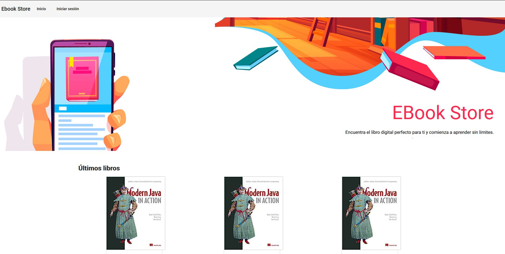

<h1 align="center">
    <strong>Ebook Store</strong>    
    <br>Full Stack Developer<br/>
    Java | Spring Boot | TypeScript | Angular
</h1>

<p align="center">
    
        
    <br/>
</p>

<p align="center">
    <a href="#bookmark-sobre-el-proyecto">Sobre el Proyecto</a>&nbsp;&nbsp;&nbsp;|&nbsp;&nbsp;&nbsp;
    <a href="#rocket-tecnologías-utilizadas">Tecnologías</a>&nbsp;&nbsp;&nbsp;|&nbsp;&nbsp;&nbsp;
    <a href="#boom-como-ejecutarlo">Como Ejecutarlo</a>
</p>

<p align="center">
    
<p>

## :bookmark: Sobre el Proyecto

**Ebook Store** es una aplicación web destinada a permitir generar pedidos de libros y mantenimiento de la información de los libros.

## :rocket: Tecnologías Utilizadas

- [PostgreSQL](https://www.postgresql.org/)
- [Java](https://java.com/)
- [Spring Boot](https://spring.io/)
- [Spring Boot](https://spring.io/)
- [TypeScript](https://www.typescriptlang.org/)
- [Angular](https://angular.io/)
- [Angular Material](https://material.angular.io/)

## :boom: Como Ejecutarlo

- ### **Requisitos**

  - Es **obligatorio** tener **[Java 11](https://java.com/)** y **[Spring Boot](https://spring.io/)**.
  - Es **obligatorio** tener **[Git](https://git-scm.com/)** instalado y y configurado.
  - Además, debe **tener** el **[IDE IntelliJ IDEA](https://www.jetbrains.com/es-es/idea/)** instalado para abrir el backend.

1. Clonar el repositorio:

```sh
  $ git clone https://github.com/henrymendozapuerta/EbookStore.git
```

2. Ejecutando la aplicación:

```sh
  # API
  # Para abrir el backend es necesario:
  # > Ir a IntelliJ IDEA
  # > Abrir el proyecto

  # APLICACIÓN WEB
  $ cd frontend
  # Instalar las dependencias del proyecto
  $ npm install # o yarn install
  # Abrir el proyecto en Visual Studio Code
  $ npm run start # o yarn start
```
